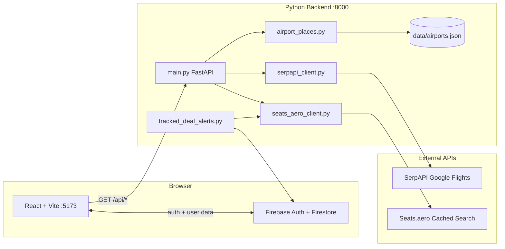

# FlightHero

A flight search web app for award travelers. Compare **cash fares** (Google Flights via SerpAPI) and **award availability** (Seats.aero), track routes, and get context on transfer partners and cents-per-point value.

The UI is a React SPA; the backend is a FastAPI service that proxies flight search, serves local airport autocomplete, and runs optional daily price-alert jobs.

## Features

### Search (no account required)

- **One-way and round-trip** flight search
- **Cash vs. points** toggle — cash uses SerpAPI; points uses Seats.aero cached award data
- **Airport autocomplete** with instant local search (~5 ms) over ~7,900 IATA-coded airports
- **Filters and sorting** — stops, price, duration, max taxes (points)
- **Round-trip details** — outbound and return leg times, flight numbers, and stop counts
- **Cabin class** — economy, premium economy, business, first
- **Transfer partner badges** and transfer-bonus hints on award results
- **Cents-per-point (CPP)** display using your saved valuations or defaults
- **Booking links** — cash bookings via Google Flights redirect; award bookings via airline program and Seats.aero links
- **Trending deals** — curated award routes on the home page; click to search live

### Accounts (Firebase)

Sign-in is optional for search, but required for cloud-synced features:

- **Email/password and Google** sign-in
- **Profile** — display name, home airport, military/Zulu time, custom CPP valuations per transfer partner
- **Tracked deals** — save award routes from search results (up to 20 per user)
- **Price-drop alerts** — one free alert per account (bell icon on tracked routes); emails when award points drop
- **Continue searching** — recent searches shown on the home page for signed-in users

### Content pages

- **FAQ** — transfers, award booking, valuation
- **Points News** — manually curated card offers and transfer bonuses
- **Contact** — messages saved to Firestore (optional email via Firebase Trigger Email extension)
- **Legal** — trademark and third-party notice

## Architecture



| Layer | Technology | Role |
|-------|------------|------|
| Frontend | React 19, TypeScript, Vite, React Router | Search UI, profile, tracked deals, content pages |
| Auth & data | Firebase Auth, Firestore | Users, preferences, tracked deals, contact messages, alert emails |
| Backend | FastAPI, httpx | Flight search API, booking redirect, alert cron endpoint |
| Airport data | [mwgg/Airports](https://github.com/mwgg/Airports) | Local JSON autocomplete (MIT) |
| Cash fares | [SerpAPI Google Flights](https://serpapi.com/google-flights-api) | Live cash prices and booking tokens |
| Award data | [Seats.aero](https://developers.seats.aero/reference/cached-search) | Cached award availability and program metadata |

## Prerequisites

- **Node.js** 18+ (npm or pnpm)
- **Python** 3.11+
- **SerpAPI** API key — required for cash search ([dashboard](https://serpapi.com/manage-api-key))
- **Seats.aero Pro** API key — required for points search ([seats.aero](https://seats.aero/) → Settings → API)
- **Firebase project** — optional for local search-only use; required for sign-in, tracked deals, contact form, and price alerts

## Quick start

### 1. Clone and install

```bash
# Frontend
npm install

# Backend
pip install -r requirements.txt
```

### 2. Configure backend environment

Copy the example env file and add your API keys:

```bash
cp .env.example .env
```

Minimum for search:

```env
SERPAPI_API_KEY=your_api_key_here
SEATS_AERO_API_KEY=your_seats_aero_key
SERPAPI_CURRENCY=USD
SERPAPI_GL=us
SERPAPI_HL=en
```

If you set `APP_API_KEY` in `.env`, you must also set the same value as `VITE_APP_API_KEY` in `.env.local` (see below). A mismatch causes **403 Forbidden** on API calls.

### 3. Configure frontend environment (optional)

Create `.env.local` in the project root for Firebase and API settings:

```env
# Only needed if the backend is not on localhost:8000
# VITE_API_BASE_URL=http://localhost:8000

# Must match APP_API_KEY in .env when the app key gate is enabled
# VITE_APP_API_KEY=

VITE_FIREBASE_API_KEY=your_api_key
VITE_FIREBASE_AUTH_DOMAIN=your-project.firebaseapp.com
VITE_FIREBASE_PROJECT_ID=your-project-id
VITE_FIREBASE_STORAGE_BUCKET=your-project.firebasestorage.app
VITE_FIREBASE_MESSAGING_SENDER_ID=your_sender_id
VITE_FIREBASE_APP_ID=your_app_id

# Optional — inbox notification for contact form (requires Trigger Email extension)
# VITE_CONTACT_TO_EMAIL=you@example.com
```

Deploy `firestore.rules` to your Firebase project. Without Firebase configured, search still works; sign-in, tracking, and contact will show a configuration message.

### 4. Airport dataset

Autocomplete uses `data/airports.json` from [mwgg/Airports](https://github.com/mwgg/Airports). If the file is missing, download it:

```bash
mkdir -p data
curl -L -o data/airports.json https://raw.githubusercontent.com/mwgg/Airports/master/airports.json
```

On Windows PowerShell:

```powershell
mkdir data -Force
python -c "import httpx; from pathlib import Path; p=Path('data/airports.json'); p.parent.mkdir(exist_ok=True); p.write_bytes(httpx.get('https://raw.githubusercontent.com/mwgg/Airports/master/airports.json', timeout=120).content)"
```

### 5. Run both servers

Two processes must be running:

```bash
# Terminal 1 — backend
py main.py
# → http://localhost:8000

# Terminal 2 — frontend
npm run dev
# → http://localhost:5173
```

Open **http://localhost:5173** in your browser.

## Environment variables

### Backend (`.env`)

| Variable | Required | Default | Description |
|----------|----------|---------|-------------|
| `SERPAPI_API_KEY` | Cash search | — | SerpAPI key for Google Flights (**backend only**) |
| `SEATS_AERO_API_KEY` | Points search | — | Seats.aero Pro API key (**backend only**) |
| `SERPAPI_CURRENCY` | No | `USD` | Currency for displayed prices |
| `SERPAPI_GL` | No | `us` | Google country code (market) |
| `SERPAPI_HL` | No | `en` | Language code |
| `ALLOWED_ORIGINS` | No | `http://localhost:5173,...` | Comma-separated browser origins (CORS + origin check) |
| `APP_API_KEY` | No | — | Optional shared secret sent as `X-App-Key` header |
| `RATE_LIMIT_REQUESTS` | No | `60` | Max API requests per IP per window |
| `RATE_LIMIT_WINDOW_SECONDS` | No | `60` | Rate limit window in seconds |
| `INTERNAL_RATE_LIMIT_REQUESTS` | No | `6` | Max requests per IP per window on `/api/internal/*` |
| `INTERNAL_RATE_LIMIT_WINDOW_SECONDS` | No | `3600` | Internal rate limit window |
| `FIREBASE_PROJECT_ID` | Alerts | — | Firebase project ID for alert cron |
| `FIREBASE_SERVICE_ACCOUNT_PATH` | Alerts | — | Path to Firebase Admin service account JSON |
| `ALERTS_CRON_SECRET` | Alerts | — | Secret for `X-Alerts-Cron-Secret` on the alert endpoint |
| `APP_BASE_URL` | Alerts | `http://localhost:5173` | Site URL included in alert emails |

### Frontend (`.env.local` or CI build secrets)

| Variable | Description |
|----------|-------------|
| `VITE_API_BASE_URL` | Backend URL (default `http://localhost:8000`) |
| `VITE_APP_API_KEY` | Same as `APP_API_KEY` when the app key gate is enabled |
| `VITE_FIREBASE_API_KEY` | Firebase web API key |
| `VITE_FIREBASE_AUTH_DOMAIN` | Firebase auth domain |
| `VITE_FIREBASE_PROJECT_ID` | Firebase project ID |
| `VITE_FIREBASE_STORAGE_BUCKET` | Firebase storage bucket |
| `VITE_FIREBASE_MESSAGING_SENDER_ID` | Firebase messaging sender ID |
| `VITE_FIREBASE_APP_ID` | Firebase app ID |
| `VITE_CONTACT_TO_EMAIL` | Optional inbox address for contact form emails |

## Price-drop alerts

Users can enable a bell on one tracked route. A daily job compares current award pricing to the saved baseline and queues an email when points drop.

**Requirements:**

1. Firebase configured on frontend and backend (Admin SDK for the cron job)
2. Firebase **Trigger Email from Firestore** extension installed (writes to the `mail` collection)
3. `ALERTS_CRON_SECRET`, `FIREBASE_PROJECT_ID`, and `FIREBASE_SERVICE_ACCOUNT_PATH` in `.env`
4. A daily scheduler calling either:

```bash
python scripts/run_tracked_deal_alerts.py
```

or:

```bash
curl -X POST -H "X-Alerts-Cron-Secret: $ALERTS_CRON_SECRET" https://your-api.example.com/api/internal/check-tracked-deals
```

## Hosting & security

**GitHub Pages serves static files only.** SerpAPI and Seats.aero keys must stay on a separate backend (Railway, Render, Fly.io, a VPS, etc.). The frontend never receives those keys.

Backend safety net (stops casual abuse, not determined scraping):

1. **CORS + origin allowlist** — Add your production frontend URL to `ALLOWED_ORIGINS`.
2. **Per-IP rate limiting** — Defaults to 60 requests/minute on `/api/*`.
3. **Optional `APP_API_KEY`** — Requests must include matching `X-App-Key`. Set the same value as `VITE_APP_API_KEY` at build time.

`APP_API_KEY` is visible in the JavaScript bundle. Use it together with rate limits and provider-side spending caps, not as sole protection.

**Do not** put `SERPAPI_API_KEY` or `SEATS_AERO_API_KEY` in GitHub Actions variables for the Pages build — only for backend deployment.

## API reference

### `GET /api/health`

Returns service status.

```json
{ "status": "ok" }
```

### `GET /api/places/suggestions?q={query}`

Airport/city autocomplete. Requires at least 2 characters.

Uses the local airport dataset when `data/airports.json` exists; otherwise falls back to SerpAPI Google Flights Autocomplete.

### `GET /api/search`

| Parameter | Required | Description |
|-----------|----------|-------------|
| `origin` | Yes | Airport label or code (e.g. `Boston (BOS)`) |
| `destination` | Yes | Airport label or code |
| `departure_date` | Yes | `YYYY-MM-DD` |
| `return_date` | Round-trip | `YYYY-MM-DD` |
| `trip_type` | No | `round-trip` (default) or `one-way` |
| `search_type` | No | `cash` (default) or `points` |
| `adults` | No | 1–9 (default 1) |
| `children` | No | 0–8 (default 0) |
| `cabin_class` | No | `economy`, `premium-economy`, `business`, `first` |

When `search_type=points`, each result includes `award_details` (mileage cost, taxes/fees, program, transfer partners, booking links). If SerpAPI is also configured, results are enriched with matched cash prices for CPP comparison.

### `POST /api/search/return-legs`

Loads return flight details for round-trip cash results (called in the background by the UI).

### `GET /api/booking-redirect`

Auto-post redirect to a cash booking partner via SerpAPI `booking_token`. Falls back to a Google Flights search URL on failure.

### `POST /api/internal/check-tracked-deals`

Runs the daily price-alert job. Requires `X-Alerts-Cron-Secret` header matching `ALERTS_CRON_SECRET`.

### HTTP status codes

| Code | Meaning |
|------|---------|
| `200` | Success |
| `400` | Invalid input |
| `403` | Forbidden (wrong `X-App-Key`, origin, or cron secret) |
| `409` | Alert check already in progress |
| `410` | No flights for the selected dates |
| `429` | Rate limit or upstream quota |
| `502` | Upstream API failure |
| `503` | Missing API key, Firebase Admin, or airport dataset |

## How flight search works

### Cash — one-way

A single SerpAPI `google_flights` request with `type=2`.

### Cash — round-trip

Two-phase so the initial response stays fast:

1. **Outbound search** (`GET /api/search`) — one SerpAPI request; returns outbound flights and round-trip prices.
2. **Return leg details** (`POST /api/search/return-legs`) — background load for up to 15 unique `departure_token` values.

### Points

Queries Seats.aero cached search. Round-trip combines outbound and return when the same mileage program has seats on both dates. Award data may be a few hours old — always verify on the airline or Seats.aero before booking.

### Airport autocomplete

`airport_places.py` scores matches against IATA code, code prefix, and city/airport name. Results are cached in memory for 10 minutes per query.

## Project structure

```
flight-app/
├── App.tsx                 # Home page — search, results, trending deals
├── main.tsx                # Router and providers
├── main.py                 # FastAPI app and routes
├── api_security.py         # CORS, rate limits, app key middleware
├── serpapi_client.py       # Cash search, booking redirect, fallback autocomplete
├── seats_aero_client.py    # Award/points search
├── airport_places.py       # Local airport autocomplete
├── flight_matching.py      # Enrich award results with cash prices
├── tracked_deal_alerts.py  # Daily price-drop email job
├── firebase_admin_client.py
├── components/             # UI components (navbar, deals, autocomplete, …)
├── pages/                  # Auth, profile, FAQ, legal, contact, points news
├── context/                # Auth and tracked-deals React context
├── lib/                    # Firebase, auth, API helpers, tracked deals
├── data/                   # airports.json, trending deals, transfer bonuses, FAQ
├── scripts/                # Alert cron helper, deal image fetcher
├── firestore.rules         # Firestore security rules
├── .env.example
├── requirements.txt
└── package.json
```

## Routes

| Path | Page |
|------|------|
| `/` | Flight search |
| `/auth/sign-in` | Sign in |
| `/auth/sign-up` | Create account |
| `/auth/forgot-password` | Password reset |
| `/profile` | Settings, preferences, tracked deals |
| `/faq` | FAQ |
| `/points-news` | Card offers and transfer bonuses |
| `/contact` | Contact form |
| `/legal` | Legal notice |

## Troubleshooting

### API returns 403 Forbidden

- If `APP_API_KEY` is set in `.env`, add the same value to `.env.local` as `VITE_APP_API_KEY` and restart the Vite dev server.
- Ensure your browser origin is listed in `ALLOWED_ORIGINS`.

### Autocomplete is slow

Ensure `data/airports.json` exists. Without it, each keystroke falls back to SerpAPI (~600–1500 ms).

### Search returns 429

SerpAPI or Seats.aero quota exhausted. Round-trip cash searches use multiple SerpAPI calls (1 outbound + up to 15 return-leg lookups).

### Search returns 410

No flights found for those dates/route on Google Flights. Try different dates or airports.

### `Could not reach the flight search server`

The Python backend is not running. Start it with `py main.py` on port 8000.

### Firebase / sign-in errors

Add all `VITE_FIREBASE_*` variables to `.env.local` and deploy `firestore.rules`. Restart `npm run dev` after changing env files.

### Price alerts not sending

Confirm Firebase Admin credentials, Trigger Email extension, `ALERTS_CRON_SECRET`, and that the daily cron job is scheduled. Check the `mail` collection in Firestore for queued messages.

### Backend changes not applied

Restart `py main.py` after editing Python files or `.env`.

## Credits

- Airport data: [mwgg/Airports](https://github.com/mwgg/Airports) (MIT License)
- Cash fares: [SerpAPI](https://serpapi.com/) Google Flights API
- Award data: [Seats.aero](https://seats.aero/)
