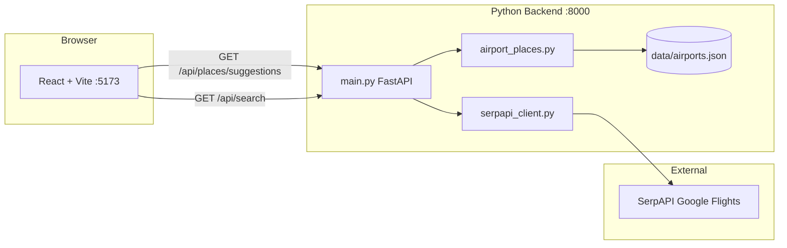

# PointsFlight Finder

A flight search web app that compares **cash fares** (via Google Flights through SerpAPI) and **award availability** (via Seats.aero). The UI is a React SPA; the backend is a small FastAPI service that proxies flight search and serves fast local airport autocomplete.

## Features

- **One-way and round-trip** flight search
- **Cash vs. points** view toggle — cash uses SerpAPI; points uses live Seats.aero award availability
- **Airport autocomplete** with instant local search (~5 ms) over ~7,900 IATA-coded airports
- **Filters and sorting** — stops, price, duration
- **Round-trip details** — outbound and return leg times, flight numbers, and stop counts
- **Cabin class** — economy, premium economy, business, first

## Architecture



| Layer | Technology | Role |
|-------|------------|------|
| Frontend | React 19, TypeScript, Vite | Search UI, results, autocomplete |
| Backend | FastAPI, httpx | API routes, SerpAPI integration |
| Airport data | [mwgg/Airports](https://github.com/mwgg/Airports) | Local JSON autocomplete (MIT) |
| Flight data | [SerpAPI Google Flights](https://serpapi.com/google-flights-api) | Live cash fares |

## Prerequisites

- **Node.js** 18+ (npm or pnpm)
- **Python** 3.11+
- A **SerpAPI** API key ([dashboard](https://serpapi.com/manage-api-key))

## Quick start

### 1. Clone and install

```bash
# Frontend
npm install

# Backend
pip install -r requirements.txt
```

### 2. Configure environment

Copy the example env file and add your API keys:

```bash
cp .env.example .env
```

```env
SERPAPI_API_KEY=your_api_key_here          # required for cash search
SEATS_AERO_API_KEY=your_seats_aero_key     # required for points search
SERPAPI_CURRENCY=USD
SERPAPI_GL=us
SERPAPI_HL=en
```

### 3. Airport dataset

Autocomplete uses `data/airports.json` from the [mwgg/Airports](https://github.com/mwgg/Airports) project. If the file is missing, download it:

```bash
mkdir -p data
curl -L -o data/airports.json https://raw.githubusercontent.com/mwgg/Airports/master/airports.json
```

On Windows PowerShell:

```powershell
mkdir data -Force
python -c "import httpx; from pathlib import Path; p=Path('data/airports.json'); p.parent.mkdir(exist_ok=True); p.write_bytes(httpx.get('https://raw.githubusercontent.com/mwgg/Airports/master/airports.json', timeout=120).content)"
```

### 4. Run both servers

Two processes must be running:

```bash
# Terminal 1 — backend
py main.py
# → http://localhost:8000

# Terminal 2 — frontend
npm run dev
# → http://localhost:5173
```

Open **http://localhost:5173** in your browser.

## Environment variables

| Variable | Required | Default | Description |
|----------|----------|---------|-------------|
| `SERPAPI_API_KEY` | Cash search | — | SerpAPI key for Google Flights cash fares (**backend only**) |
| `SEATS_AERO_API_KEY` | Points search | — | Seats.aero Pro API key for award availability (**backend only**) |
| `SERPAPI_CURRENCY` | No | `USD` | Currency for displayed prices |
| `SERPAPI_GL` | No | `us` | Google country code (market) |
| `SERPAPI_HL` | No | `en` | Language code |
| `ALLOWED_ORIGINS` | No | `http://localhost:5173,...` | Comma-separated origins allowed to call the API |
| `APP_API_KEY` | No | — | Optional shared secret sent as `X-App-Key` (see [Hosting & security](#hosting--security)) |
| `RATE_LIMIT_REQUESTS` | No | `60` | Max API requests per IP per window |
| `RATE_LIMIT_WINDOW_SECONDS` | No | `60` | Rate limit window in seconds |

Frontend build (`.env.local` or CI secrets, not committed):

| Variable | Description |
|----------|-------------|
| `VITE_API_BASE_URL` | Backend URL (e.g. `https://api.yoursite.com`) |
| `VITE_APP_API_KEY` | Same as `APP_API_KEY` when the app key gate is enabled |

## Hosting & security

**GitHub Pages serves static files only.** Your API keys must stay on a separate backend (Railway, Render, Fly.io, a VPS, etc.). The frontend never receives `SERPAPI_API_KEY` or `SEATS_AERO_API_KEY`.

This project includes a small **backend safety net** (not bulletproof, but stops casual abuse):

1. **CORS + origin allowlist** — Browser calls from other sites are blocked unless their origin is in `ALLOWED_ORIGINS` (add your Pages URL, e.g. `https://username.github.io`).
2. **Per-IP rate limiting** — Defaults to 60 requests/minute per IP on `/api/*`.
3. **Optional `APP_API_KEY`** — If set on the backend, requests must include `X-App-Key`. The matching `VITE_APP_API_KEY` is baked into the frontend at build time.

**Important:** `APP_API_KEY` is visible to anyone who downloads your JavaScript bundle. It stops drive-by scripts and random sites from hitting your API, but a determined scraper can extract it. Real protection is: keep SerpAPI on the server, rate limit, monitor SerpAPI usage, and set SerpAPI account spending limits.

**Do not** put `SERPAPI_API_KEY` in GitHub Actions variables that feed the Pages build — only use them for backend deployment.

## API reference

### `GET /api/health`

Returns service status.

```json
{
  "status": "ok"
}
```

### `GET /api/places/suggestions?q={query}`

Airport/city autocomplete. Requires at least 2 characters.

**Response** — array of suggestions:

```json
[
  {
    "id": "BOS",
    "code": "BOS",
    "name": "Boston",
    "subtitle": "General Edward Lawrence Logan International Airport, Massachusetts, US",
    "type": "airport"
  }
]
```

Uses the local airport dataset when `data/airports.json` exists; otherwise falls back to SerpAPI Google Flights Autocomplete.

### `GET /api/search`

Flight search powered by SerpAPI Google Flights.

| Parameter | Required | Description |
|-----------|----------|-------------|
| `origin` | Yes | Airport label or code (e.g. `Boston (BOS)`) |
| `destination` | Yes | Airport label or code |
| `departure_date` | Yes | `YYYY-MM-DD` |
| `return_date` | Round-trip | `YYYY-MM-DD` |
| `trip_type` | No | `round-trip` (default) or `one-way` |
| `search_type` | No | `cash` (default) or `points` |
| `adults` | No | 1–9 (default 1) |
| `children` | No | 0–8 (default 0) |
| `cabin_class` | No | `economy`, `premium-economy`, `business`, `first` |

**Example:**

```
GET /api/search?origin=Boston+(BOS)&destination=New+York+(JFK)&departure_date=2026-06-24&return_date=2026-06-26&trip_type=round-trip&search_type=cash
```

**Response** — array of flight offers:

```json
[
  {
    "id": "...",
    "departure_token": "...",
    "origin": "BOS",
    "destination": "JFK",
    "departure_date": "2026-06-24",
    "departure_time": "6:00 AM",
    "arrival_time": "7:15 AM",
    "carrier": "JetBlue",
    "flight_number": "B6 517",
    "duration": "1h 15m",
    "duration_minutes": 75,
    "stops": 0,
    "cash_price": 189.0
  }
]
```

For round-trip searches, return-leg fields are loaded separately via `POST /api/search/return-legs` (see below).

When `search_type=points`, each result includes `award_details` from Seats.aero with live mileage cost, taxes/fees, mileage program, and suggested transfer partners.

### Points search (Seats.aero)

When `search_type=points`, the backend queries [Seats.aero Cached Search](https://developers.seats.aero/reference/cached-search) instead of SerpAPI:

1. **One-way** — Award availability for the route on the departure date, sorted by lowest mileage.
2. **Round-trip** — Outbound and return cached searches run in parallel; results are combined when the same mileage program has seats on both dates (total points = outbound + return).

Requires a Seats.aero Pro API key (`SEATS_AERO_API_KEY`). Cached data may be a few hours old; seat counts and pricing come from Seats.aero's index, not live airline booking engines.

### `POST /api/search/return-legs`

Loads return flight details for round-trip results (called in the background by the UI).

**Body:**

```json
{
  "origin": "Boston (BOS)",
  "destination": "New York (JFK)",
  "departure_date": "2026-06-24",
  "return_date": "2026-06-26",
  "departure_tokens": ["token1", "token2"]
}
```

**Response** — map of `departure_token` → return leg fields (`return_departure_time`, `return_arrival_time`, `return_flight_number`, `return_carrier`, `return_stops`).

### HTTP status codes

| Code | Meaning |
|------|---------|
| `200` | Success |
| `400` | Invalid input (e.g. bad airport code) |
| `410` | No flights for the selected dates (from SerpAPI) |
| `429` | SerpAPI rate limit / quota |
| `502` | Upstream SerpAPI failure (5xx) |
| `503` | Missing API key or airport dataset |

Client errors (400, 410, 429) are passed through as-is rather than mapped to 502.

## How flight search works

### One-way

A single SerpAPI `google_flights` request with `type=2`.

### Round-trip

Round-trip search is **two-phase** so the initial response stays in the ~2–5 second range:

1. **Outbound search** (`GET /api/search`) — One SerpAPI request with `type=1`. Returns outbound flights and round-trip prices immediately.
2. **Return leg details** (`POST /api/search/return-legs`) — The frontend loads return times and flight numbers in the background for up to 15 unique `departure_token` values (fetched in parallel on the server). Cards show “Loading return flight…” until this completes.

3. **Deduping** — Identical itineraries are merged, keeping the lowest price.
4. **Sorting** — Results are sorted by `cash_price` ascending.

This matches [SerpAPI's round-trip flow](https://serpapi.com/google-flights-api): the first response returns outbound options with round-trip prices; return segments require a follow-up call per outbound option.

## How airport autocomplete works

`airport_places.py` loads `data/airports.json` once into memory and scores matches against:

1. Exact IATA code (e.g. `BOS`)
2. IATA prefix (e.g. `JF` → `JFK`)
3. City / state / airport name prefix and substring matches

Results are cached in memory for 10 minutes per query. No network calls are made for autocomplete when the local dataset is present.

## Project structure

```
flight-app/
├── App.tsx              # React UI (search form, results, autocomplete)
├── main.tsx             # React entry point
├── main.py              # FastAPI app and routes
├── serpapi_client.py    # SerpAPI cash flight search + fallback autocomplete
├── seats_aero_client.py # Seats.aero award/points search
├── airport_places.py    # Local airport autocomplete
├── data/
│   └── airports.json    # mwgg/Airports dataset (~9 MB)
├── .env.example         # Environment template
├── requirements.txt     # Python dependencies
├── package.json         # Node dependencies
└── vite.config.ts       # Vite dev server (port 5173)
```

## Points search notes

Award results come from **Seats.aero cached availability**, not SerpAPI. Data is refreshed on Seats.aero's schedule (typically every few hours). Always verify price and availability on the airline or Seats.aero before booking.

Seats.aero Pro API access is required (`SEATS_AERO_API_KEY` in `.env`). Generate a key under **Settings → API** at [seats.aero](https://seats.aero/).

## Troubleshooting

### Autocomplete is slow

Ensure `data/airports.json` exists. Check `/api/health` — `places_provider` should be `"local"`. If it says `"serpapi"`, the dataset is missing and each keystroke hits SerpAPI (~600–1500 ms).

### Search returns 429

SerpAPI quota exhausted. Check your [SerpAPI dashboard](https://serpapi.com/dashboard). Round-trip searches use multiple API calls (1 outbound + up to 15 return-leg lookups).

### Search returns 410

No flights found for those dates/route on Google Flights. Try different dates or airports.

### `Could not reach the flight search server`

The Python backend is not running. Start it with `py main.py` on port 8000.

### Backend changes not applied

Restart `py main.py` after editing Python files or `.env`.

## Credits

- Airport data: [mwgg/Airports](https://github.com/mwgg/Airports) (MIT License)
- Flight data: [SerpAPI](https://serpapi.com/) Google Flights API
