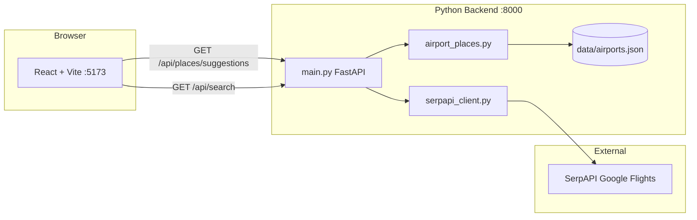

# PointsFlight Finder

A flight search web app that compares **cash fares** (via Google Flights through SerpAPI) and **estimated award pricing** (points + transfer partners). The UI is a React SPA; the backend is a small FastAPI service that proxies flight search and serves fast local airport autocomplete.

## Features

- **One-way and round-trip** flight search
- **Cash vs. points** view toggle (points are estimated, not live award inventory)
- **Airport autocomplete** with instant local search (~5 ms) over ~7,900 IATA-coded airports
- **Filters and sorting** — stops, price, duration
- **Round-trip details** — outbound and return leg times, flight numbers, and stop counts
- **Cabin class** — economy, premium economy, business, first

## Architecture



| Layer | Technology | Role |
|-------|------------|------|
| Frontend | React 19, TypeScript, Vite | Search UI, results, autocomplete |
| Backend | FastAPI, httpx | API routes, SerpAPI integration |
| Airport data | [mwgg/Airports](https://github.com/mwgg/Airports) | Local JSON autocomplete (MIT) |
| Flight data | [SerpAPI Google Flights](https://serpapi.com/google-flights-api) | Live cash fares |

## Prerequisites

- **Node.js** 18+ (npm or pnpm)
- **Python** 3.11+
- A **SerpAPI** API key ([dashboard](https://serpapi.com/manage-api-key))

## Quick start

### 1. Clone and install

```bash
# Frontend
npm install

# Backend
pip install -r requirements.txt
```

### 2. Configure environment

Copy the example env file and add your SerpAPI key:

```bash
cp .env.example .env
```

```env
SERPAPI_API_KEY=your_api_key_here
SERPAPI_CURRENCY=USD
SERPAPI_GL=us
SERPAPI_HL=en
```

### 3. Airport dataset

Autocomplete uses `data/airports.json` from the [mwgg/Airports](https://github.com/mwgg/Airports) project. If the file is missing, download it:

```bash
mkdir -p data
curl -L -o data/airports.json https://raw.githubusercontent.com/mwgg/Airports/master/airports.json
```

On Windows PowerShell:

```powershell
mkdir data -Force
python -c "import httpx; from pathlib import Path; p=Path('data/airports.json'); p.parent.mkdir(exist_ok=True); p.write_bytes(httpx.get('https://raw.githubusercontent.com/mwgg/Airports/master/airports.json', timeout=120).content)"
```

### 4. Run both servers

Two processes must be running:

```bash
# Terminal 1 — backend
py main.py
# → http://localhost:8000

# Terminal 2 — frontend
npm run dev
# → http://localhost:5173
```

Open **http://localhost:5173** in your browser.

## Environment variables

| Variable | Required | Default | Description |
|----------|----------|---------|-------------|
| `SERPAPI_API_KEY` | Yes | — | SerpAPI key for flight search |
| `SERPAPI_CURRENCY` | No | `USD` | Currency for displayed prices |
| `SERPAPI_GL` | No | `us` | Google country code (market) |
| `SERPAPI_HL` | No | `en` | Language code |

## API reference

### `GET /api/health`

Returns service status and configuration flags.

```json
{
  "status": "ok",
  "serpapi_configured": true,
  "airport_data_available": true,
  "places_provider": "local",
  "env_file_exists": true
}
```

### `GET /api/places/suggestions?q={query}`

Airport/city autocomplete. Requires at least 2 characters.

**Response** — array of suggestions:

```json
[
  {
    "id": "BOS",
    "code": "BOS",
    "name": "Boston",
    "subtitle": "General Edward Lawrence Logan International Airport, Massachusetts, US",
    "type": "airport"
  }
]
```

Uses the local airport dataset when `data/airports.json` exists; otherwise falls back to SerpAPI Google Flights Autocomplete.

### `GET /api/search`

Flight search powered by SerpAPI Google Flights.

| Parameter | Required | Description |
|-----------|----------|-------------|
| `origin` | Yes | Airport label or code (e.g. `Boston (BOS)`) |
| `destination` | Yes | Airport label or code |
| `departure_date` | Yes | `YYYY-MM-DD` |
| `return_date` | Round-trip | `YYYY-MM-DD` |
| `trip_type` | No | `round-trip` (default) or `one-way` |
| `search_type` | No | `cash` (default) or `points` |
| `adults` | No | 1–9 (default 1) |
| `children` | No | 0–8 (default 0) |
| `cabin_class` | No | `economy`, `premium-economy`, `business`, `first` |

**Example:**

```
GET /api/search?origin=Boston+(BOS)&destination=New+York+(JFK)&departure_date=2026-06-24&return_date=2026-06-26&trip_type=round-trip&search_type=cash
```

**Response** — array of flight offers:

```json
[
  {
    "id": "...",
    "origin": "BOS",
    "destination": "JFK",
    "departure_date": "2026-06-24",
    "departure_time": "6:00 AM",
    "arrival_time": "7:15 AM",
    "carrier": "JetBlue",
    "flight_number": "B6 517",
    "duration": "1h 15m",
    "duration_minutes": 75,
    "stops": 0,
    "cash_price": 189.0,
    "return_departure_time": "5:00 PM",
    "return_arrival_time": "6:20 PM",
    "return_flight_number": "B6 618",
    "return_stops": 0
  }
]
```

When `search_type=points`, each result also includes `award_details` with estimated points, taxes/fees, and transfer partners (heuristic only — not live award availability).

### HTTP status codes

| Code | Meaning |
|------|---------|
| `200` | Success |
| `400` | Invalid input (e.g. bad airport code) |
| `410` | No flights for the selected dates (from SerpAPI) |
| `429` | SerpAPI rate limit / quota |
| `502` | Upstream SerpAPI failure (5xx) |
| `503` | Missing API key or airport dataset |

Client errors (400, 410, 429) are passed through as-is rather than mapped to 502.

## How flight search works

### One-way

A single SerpAPI `google_flights` request with `type=2`.

### Round-trip

1. **Outbound search** — SerpAPI request with `type=1`, `outbound_date`, and `return_date`.
2. **Return leg details** — For up to 15 outbound options, follow-up requests use each option's `departure_token` (with route parameters) to fetch return flight times and numbers. These run **in parallel** (up to 6 at a time) instead of one-by-one.
3. **Deduping** — Identical itineraries are merged, keeping the lowest price.
4. **Sorting** — Results are sorted by `cash_price` ascending.

This matches [SerpAPI's round-trip flow](https://serpapi.com/google-flights-api): the first response returns outbound options with round-trip prices; return segments require a second call per selected outbound.

## How airport autocomplete works

`airport_places.py` loads `data/airports.json` once into memory and scores matches against:

1. Exact IATA code (e.g. `BOS`)
2. IATA prefix (e.g. `JF` → `JFK`)
3. City / state / airport name prefix and substring matches

Results are cached in memory for 10 minutes per query. No network calls are made for autocomplete when the local dataset is present.

## Project structure

```
flight-app/
├── App.tsx              # React UI (search form, results, autocomplete)
├── main.tsx             # React entry point
├── main.py              # FastAPI app and routes
├── serpapi_client.py    # SerpAPI flight search + fallback autocomplete
├── airport_places.py    # Local airport autocomplete
├── data/
│   └── airports.json    # mwgg/Airports dataset (~9 MB)
├── .env.example         # Environment template
├── requirements.txt     # Python dependencies
├── package.json         # Node dependencies
└── vite.config.ts       # Vite dev server (port 5173)
```

## Points search disclaimer

The **points** tab does not query airline award charts or loyalty programs. It applies a simple heuristic on top of cash prices:

- Estimated points ≈ 70% of cash price × 100, rounded to hundreds
- Random taxes/fees range
- Generic transfer partner suggestions by airline name

Use it for UI demonstration only, not booking decisions.

## Troubleshooting

### Autocomplete is slow

Ensure `data/airports.json` exists. Check `/api/health` — `places_provider` should be `"local"`. If it says `"serpapi"`, the dataset is missing and each keystroke hits SerpAPI (~600–1500 ms).

### Search returns 429

SerpAPI quota exhausted. Check your [SerpAPI dashboard](https://serpapi.com/dashboard). Round-trip searches use multiple API calls (1 outbound + up to 15 return-leg lookups).

### Search returns 410

No flights found for those dates/route on Google Flights. Try different dates or airports.

### `Could not reach the flight search server`

The Python backend is not running. Start it with `py main.py` on port 8000.

### Backend changes not applied

Restart `py main.py` after editing Python files or `.env`.

## Credits

- Airport data: [mwgg/Airports](https://github.com/mwgg/Airports) (MIT License)
- Flight data: [SerpAPI](https://serpapi.com/) Google Flights API
